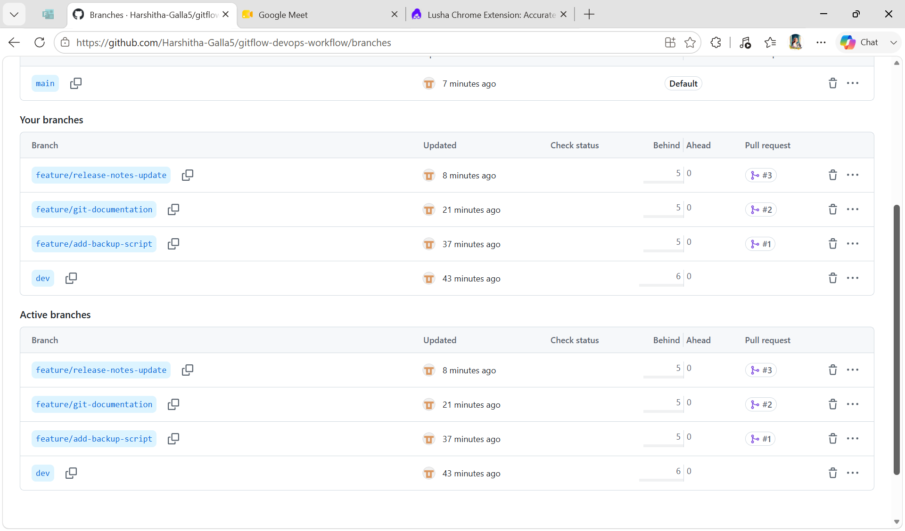
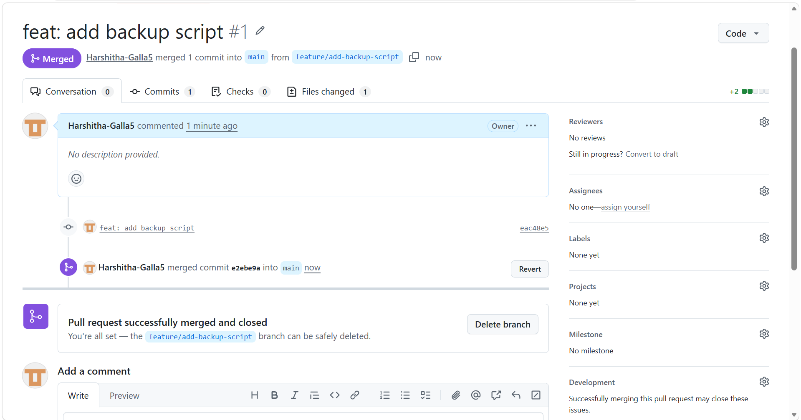
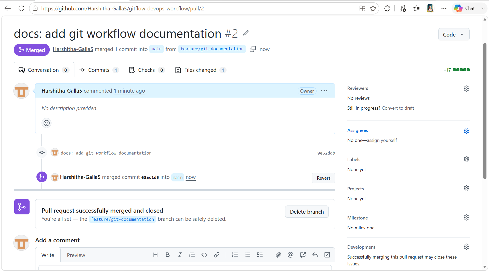
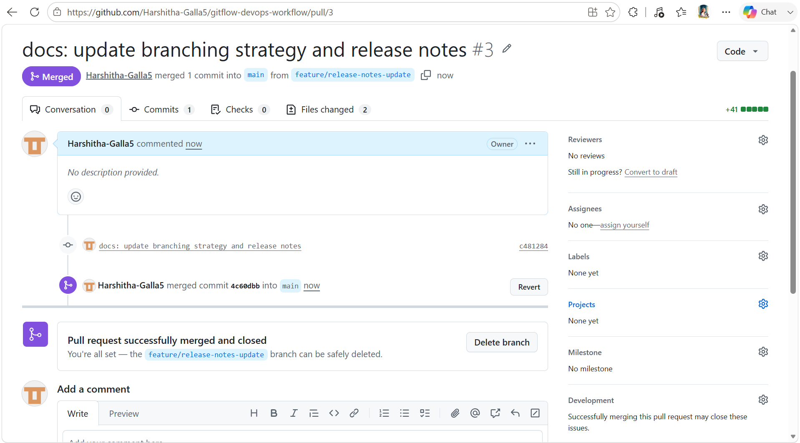
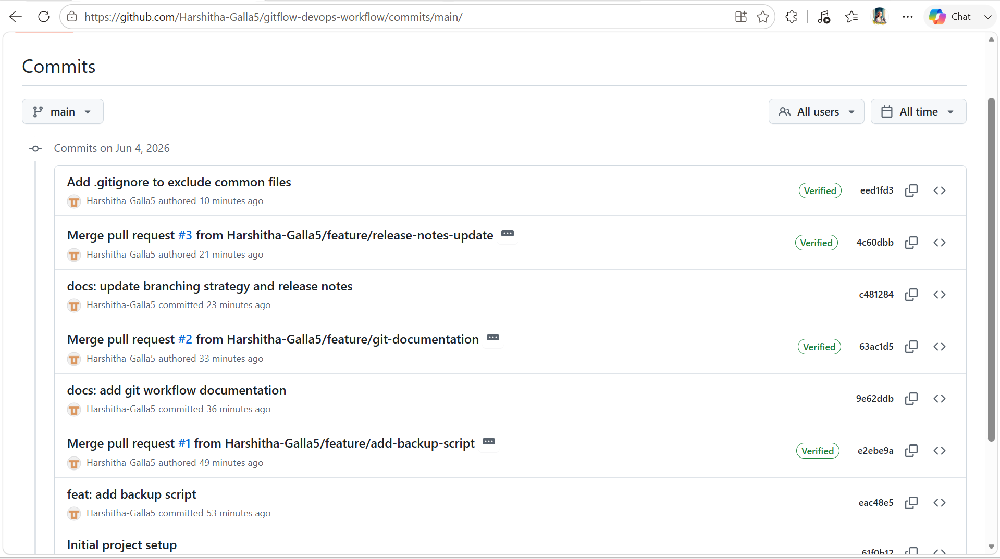
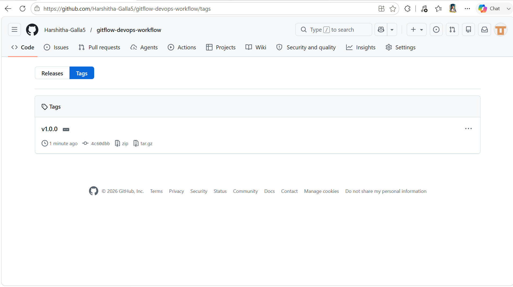

# GitFlow DevOps Workflow

## Project Overview

This project demonstrates Git version control best practices used in DevOps environments. The objective of this project is to understand and implement a structured Git workflow using GitHub repositories, feature branches, pull requests, tags, documentation, and release management.

The project follows a simplified GitFlow branching strategy and showcases how development teams collaborate on code changes before merging them into the main branch.

---

## Objectives

* Understand Git version control concepts.
* Implement a Git branching strategy.
* Create and manage feature branches.
* Use Pull Requests for code integration.
* Document project changes using Markdown.
* Create version tags for releases.
* Learn collaborative development workflows.

---

## Tools Used

| Tool     | Purpose                      |
| -------- | ---------------------------- |
| Git      | Version Control              |
| GitHub   | Remote Repository Management |
| VS Code  | Code Editor                  |
| Markdown | Documentation                |

---

## Repository Structure

```text
gitflow-devops-workflow/
│
├── README.md
├── .gitignore
│
├── docs/
│   ├── branching-strategy.md
│   ├── git-workflow.md
│   └── release-notes.md
│
└── scripts/
    └── backup.sh
```

---

## Branching Strategy

The repository follows a GitFlow-inspired workflow.

### Main Branch

The `main` branch contains stable and production-ready code.

### Development Branch

The `dev` branch is used for integrating features before releasing them to production.

### Feature Branches

Feature branches are created from the development branch for implementing specific enhancements.

Examples:

```text
feature/add-backup-script
feature/git-documentation
feature/release-notes-update
```

---

## Workflow Diagram

```text
main
 │
 └── dev
       │
       ├── feature/add-backup-script
       │         │
       │         ▼
       │       Pull Request #1
       │
       ├── feature/git-documentation
       │         │
       │         ▼
       │       Pull Request #2
       │
       └── feature/release-notes-update
                 │
                 ▼
               Pull Request #3
```

---

## Features Implemented

### Feature 1: Backup Script

A simple shell script was added to simulate a backup automation task.

File:

```text
scripts/backup.sh
```

Purpose:

* Demonstrate feature branch development.
* Showcase commit and merge workflows.

---

### Feature 2: Git Workflow Documentation

Created detailed documentation explaining:

* Git branching strategy
* Feature branch workflow
* Pull Request process

File:

```text
docs/git-workflow.md
```

---

### Feature 3: Release Notes

Created release documentation containing:

* Project changes
* Features introduced
* Version information

File:

```text
docs/release-notes.md
```

---

## Pull Requests

The following Pull Requests were created and merged:

### Pull Request #1

```text
feature/add-backup-script
          ↓
         main
```

Description:

Added backup automation script.

---

### Pull Request #2

```text
feature/git-documentation
            ↓
           main
```

Description:

Added Git workflow documentation.

---

### Pull Request #3

```text
feature/release-notes-update
              ↓
             main
```

Description:

Updated branching strategy and release notes.

---

## Commit History

```text
Initial project setup

feat: add backup script

docs: add git workflow documentation

docs: update branching strategy and release notes
```

---

## Git Commands Used

### Initialize Repository

```bash
git init
```

### Create Development Branch

```bash
git checkout -b dev
```

### Create Feature Branch

```bash
git checkout -b feature/add-backup-script
```

### Commit Changes

```bash
git add .
git commit -m "feat: add backup script"
```

### Push Branch

```bash
git push origin feature/add-backup-script
```

### Create Tag

```bash
git tag -a v1.0.0 -m "First stable release"
git push origin v1.0.0
```

---

## Versioning

Semantic Versioning was used for releases.

Current Version:

```text
v1.0.0
```

This version represents the first stable release of the project.

---

## Screenshots

### Branches

```markdown

```

---

### Pull Request #1

```markdown

```

---

### Pull Request #2

```markdown

```

---

### Pull Request #3

```markdown

```

---

### Commit History

```markdown

```

---

### Release Tag

```markdown

```

---

## Learning Outcomes

Through this project, I learned:

* Git repository management
* Branching strategies
* Feature-based development
* Pull Request workflows
* GitHub collaboration practices
* Documentation using Markdown
* Release management using Git tags
* Version control best practices used in DevOps

---

## Author

**Galla Harshitha**

Aspiring DevOps Engineer

GitHub:
https://github.com/Harshitha-Galla5
